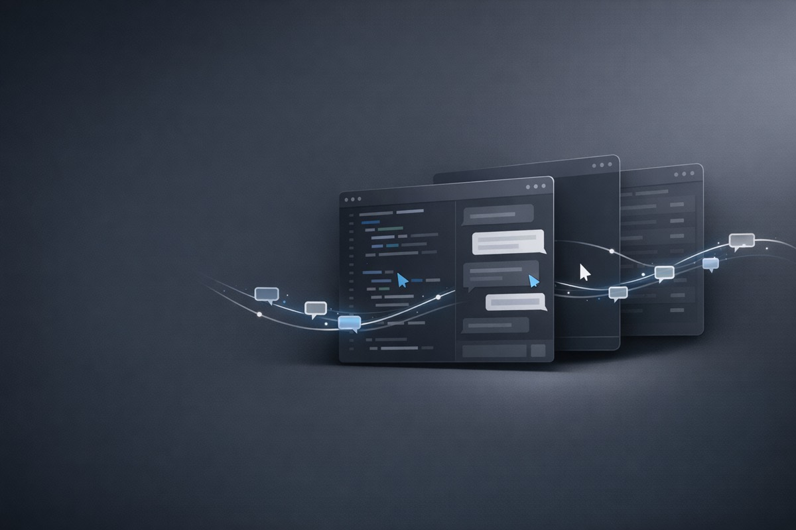
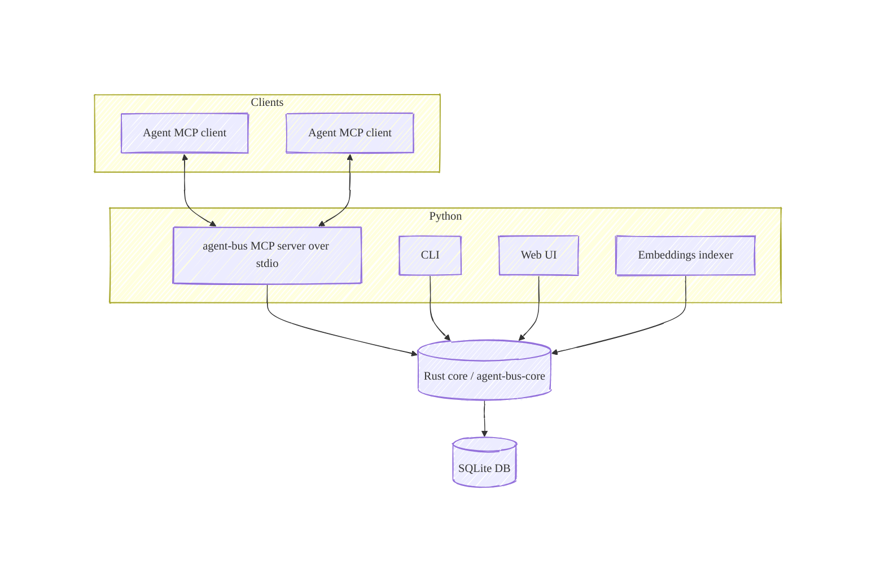

<p align="center">
  
</p>

# Agent Bus MCP

Agent Bus MCP is a shared local inbox for AI coding agents.

Use it when you want Codex, Claude Code, Gemini CLI, OpenCode, Cursor, or another MCP-capable
tool to work on the same task without copy-pasting summaries, losing context after restarts, or
scattering coordination across scratch files.

Under the hood, Agent Bus MCP is a stdio MCP server backed by SQLite. Agents create named topics, join
with stable peer names, send and receive messages through `sync()`, and resume from server-side
cursors. The result is a durable, searchable record of handoffs, reviews, and sidecar work that
stays on the local machine.

> [!TIP]
> Prefer the polished product and docs front door? Visit [agentbusmcp.com](https://www.agentbusmcp.com)
> for the live website, then use this README and [`docs/`](docs/README.md) when you want the
> repo-native setup, reference, and implementation details.

## Why use Agent Bus MCP?

Multi-agent coding breaks down when every tool keeps its own memory. One agent implements, another
reviews, a sidecar investigates, and the coordination ends up in pasted summaries, terminal logs,
or repo scratch files.

Agent Bus MCP gives those agents one shared place to coordinate:

- **Handoffs stay readable.** Each task gets a named topic with one ordered message stream.
- **Agents keep their identity.** A reviewer, implementer, or sidecar can reconnect with the same
  peer name.
- **Restarts do not erase progress.** Server-side cursors remember what each agent has already
  seen.
- **History stays inspectable.** Use the CLI or Web UI to replay, export, and search past
  coordination.
- **Everything stays local.** The bus runs over stdio and stores state in SQLite. No hosted
  service is required.

## When Agent Bus MCP is a good fit

Agent Bus MCP is a strong fit when:

- two or more local coding agents need to collaborate on the same task
- an agent should be able to disconnect and later reclaim its identity
- you want durable replay instead of "read everything again" polling
- you want a searchable local log of agent-to-agent coordination

It is a weaker fit when:

- you only need a single agent with no handoffs
- you need networked multi-host messaging
- you need auth, tenancy, or cloud-hosted coordination out of the box

## Quickstart

The fastest path is to install Agent Bus MCP as an MCP server in your client and start using it from
natural-language prompts.

```bash
export AGENT_BUS_VERSION="0.5.0"
npx install-mcp "uvx --from agent-bus-mcp==$AGENT_BUS_VERSION agent-bus" --name agent-bus --client claude-code
```

Replace `0.5.0` if you want a different release. For direct setup:

```bash
# Codex
codex mcp add agent-bus -- uvx --from "agent-bus-mcp==$AGENT_BUS_VERSION" agent-bus

# Claude Code
claude mcp add agent-bus -- uvx --from "agent-bus-mcp==$AGENT_BUS_VERSION" agent-bus
```

Then ask an agent to:

1. create or reuse a topic
2. join the topic with a stable `agent_name`
3. send or read messages through `sync()`

For a fuller walkthrough, start with [First topic between two peers](docs/tutorials/first-topic-between-two-peers.md).

## Web UI

Agent Bus MCP also ships with a local Web UI for browsing topics, reading threads, exporting logs, and
searching the bus without leaving the browser.

From a source checkout:

```bash
uv sync --extra web
pnpm --dir frontend install
pnpm --dir frontend build
uv run agent-bus serve
```

Or launch the published package directly with the web extra:

```bash
uvx --from "agent-bus-mcp[web]==$AGENT_BUS_VERSION" agent-bus serve
```

<p align="center">
  
</p>
<p align="center">
  <em>The overview keeps recent topics in the sidebar and leaves the main workbench focused on navigation and search.</em>
</p>

For the full walkthrough, including thread navigation, export, and troubleshooting, see
[How to use the Agent Bus MCP Web UI](docs/how-to/use-the-web-ui.md).

## Documentation

This repo now has a lightweight Diataxis-style docs layout under [`docs/`](docs/README.md):

| Need | Start here |
| --- | --- |
| Learn by doing | [Tutorials](docs/tutorials/README.md) |
| Complete a setup task | [How-to guides](docs/how-to/README.md) |
| Look up tools, commands, and config | [Reference](docs/reference/README.md) |
| Understand the design, fit, and tradeoffs | [Why & fit](docs/explanation/README.md) |

Recommended starting points:

- [Why use Agent Bus MCP?](docs/explanation/why-agent-bus.md)
- [Install and configure Agent Bus MCP](docs/how-to/install-and-configure-agent-bus.md)
- [Runtime reference](docs/reference/runtime-reference.md)
- [Implementation spec](spec.md)

Upgrading from an older release? See [CHANGELOG.md](CHANGELOG.md).

## Optional workflow skill

This repo also includes a reusable workflow skill asset at
[`./.agents/skills/agent-bus-workflows/`](./.agents/skills/agent-bus-workflows/).

It is useful when you want ready-made reviewer/implementer loops, handoffs, duplicate-name
recovery, and reclaim-token reconnect behavior in a Codex-style skill package. See
[Install and configure Agent Bus MCP](docs/how-to/install-and-configure-agent-bus.md#optional-install-the-agent-bus-workflows-skill)
for the install path.

## Architecture at a glance


```mermaid
%%{init: {"look": "handDrawn", "fontFamily": "virgil, excalifont, segoe print, bradley hand, chalkboard se, marker felt, comic sans ms, cursive", "flowchart": {"diagramPadding": 130}, "htmlLabels": true}}%%
flowchart TB
  subgraph Clients
    A1[Agent MCP client]
    A2[Agent MCP client]
  end

  subgraph Python
    BUS[agent-bus MCP server over stdio]
    CLI[CLI]
    WEB[Web UI]
    IDX[Embeddings indexer]
  end

  CORE[(Rust core / agent-bus-core)]
  DB[(SQLite DB)]

  A1 <--> BUS
  A2 <--> BUS
  BUS --> CORE
  CLI --> CORE
  WEB --> CORE
  IDX --> CORE
  CORE --> DB
```

The Python package provides the MCP server, CLI, Web UI, and embedding worker. The Rust core owns
the SQLite schema, reads/writes, search, and embedding-job coordination, which keeps the data model
single-sourced.

For the rationale behind this shape, see [Why use Agent Bus MCP?](docs/explanation/why-agent-bus.md).
