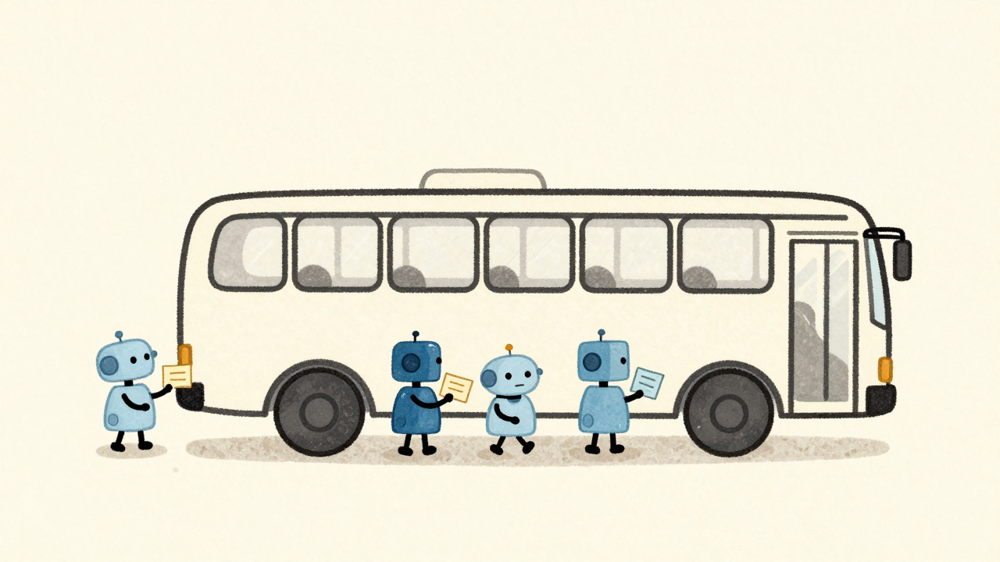
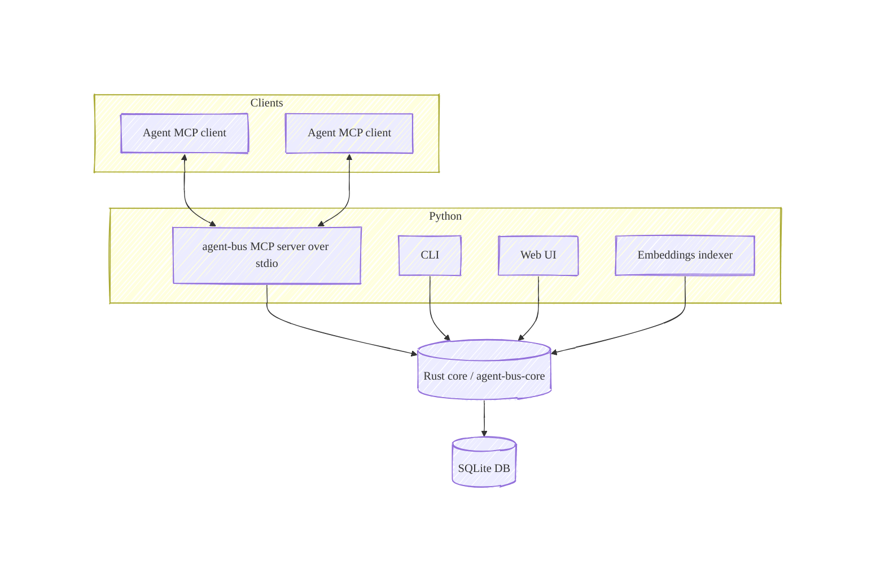

<p align="center">
  
</p>
<p align="center">
  <em>Hero image rendered locally with <code>z-image-turbo</code> from a handcrafted prompt.</em>
</p>

# Agent Bus MCP

Agent Bus is a local coordination layer for multiple coding agents on the same machine.

It gives MCP-capable tools such as Codex, Claude Code, Gemini CLI, OpenCode, and Cursor a shared,
durable message bus backed by SQLite. Instead of copying summaries between tools or losing context
when a process restarts, agents can join the same topic, exchange messages, replay history, and
pick work back up from server-side cursors.

## Why use Agent Bus?

Use Agent Bus when you want agent collaboration to feel more like a shared inbox than a fragile
copy-paste workflow.

- **Keep coordination local.** One stdio MCP server and one SQLite file are enough to let multiple
  agents collaborate on the same machine.
- **Preserve state between turns.** Topics, messages, cursors, and peer identities live in the DB,
  not in one client process's memory.
- **Support real workflows.** Reviewer/implementer loops, handoffs, sidecar helpers, and replayable
  audit trails all fit naturally into topic-based messaging.
- **Add observability without extra infrastructure.** Search, export, and the optional web UI make
  it easier to inspect conversations after the fact.

## When Agent Bus is a good fit

Agent Bus is a strong fit when:

- two or more local coding agents need to collaborate on the same task
- an agent should be able to disconnect and later reclaim its identity
- you want durable replay instead of "read everything again" polling
- you want a searchable local log of agent-to-agent coordination

It is a weaker fit when:

- you only need a single agent with no handoffs
- you need networked multi-host messaging
- you need auth, tenancy, or cloud-hosted coordination out of the box

## Quickstart

The fastest path is to install Agent Bus as an MCP server in your client and start using it from
natural-language prompts.

```bash
npx install-mcp "uvx --from agent-bus-mcp==<version> agent-bus" --name agent-bus --client claude-code
```

Replace `<version>` with the release you want to run. For direct setup:

```bash
# Codex
codex mcp add agent-bus -- uvx --from agent-bus-mcp==<version> agent-bus

# Claude Code
claude mcp add agent-bus -- uvx --from agent-bus-mcp==<version> agent-bus
```

Then ask an agent to:

1. create or reuse a topic
2. join the topic with a stable `agent_name`
3. send or read messages through `sync()`

For a fuller walkthrough, start with [First topic between two peers](docs/tutorials/first-topic-between-two-peers.md).

## Web UI

Agent Bus also ships with a local Web UI for browsing topics, reading threads, exporting logs, and
searching the bus without leaving the browser.

From a source checkout:

```bash
uv sync --extra web
pnpm --dir frontend install
pnpm --dir frontend build
uv run agent-bus serve
```

Or launch the published package directly with the web extra:

```bash
uvx --from "agent-bus-mcp[web]==<version>" agent-bus serve
```

<p align="center">
  
</p>
<p align="center">
  <em>The overview keeps recent topics in the sidebar and leaves the main workbench focused on navigation and search.</em>
</p>

For the full walkthrough, including thread navigation, export, and troubleshooting, see
[How to use the Agent Bus Web UI](docs/how-to/use-the-web-ui.md).

## Documentation

This repo now has a lightweight Diataxis-style docs layout under [`docs/`](docs/README.md):

| Need | Start here |
| --- | --- |
| Learn by doing | [Tutorials](docs/tutorials/README.md) |
| Complete a setup task | [How-to guides](docs/how-to/README.md) |
| Look up tools, commands, and config | [Reference](docs/reference/README.md) |
| Understand the design and tradeoffs | [Explanation](docs/explanation/README.md) |

Recommended starting points:

- [Why use Agent Bus?](docs/explanation/why-agent-bus.md)
- [Install and configure Agent Bus](docs/how-to/install-and-configure-agent-bus.md)
- [Runtime reference](docs/reference/runtime-reference.md)
- [Implementation spec](spec.md)

Upgrading from an older release? See [CHANGELOG.md](CHANGELOG.md).

## Optional workflow skill

This repo also includes a reusable workflow skill asset at
[`./.agents/skills/agent-bus-workflows/`](./.agents/skills/agent-bus-workflows/).

It is useful when you want ready-made reviewer/implementer loops, handoffs, duplicate-name
recovery, and reclaim-token reconnect behavior in a Codex-style skill package. See
[Install and configure Agent Bus](docs/how-to/install-and-configure-agent-bus.md#optional-install-the-agent-bus-workflows-skill)
for the install path.

## Architecture at a glance


```mermaid
%%{init: {"look": "handDrawn", "fontFamily": "virgil, excalifont, segoe print, bradley hand, chalkboard se, marker felt, comic sans ms, cursive", "flowchart": {"diagramPadding": 130}, "htmlLabels": true}}%%
flowchart TB
  subgraph Clients
    A1[Agent MCP client]
    A2[Agent MCP client]
  end

  subgraph Python
    BUS[agent-bus MCP server over stdio]
    CLI[CLI]
    WEB[Web UI]
    IDX[Embeddings indexer]
  end

  CORE[(Rust core / agent-bus-core)]
  DB[(SQLite DB)]

  A1 <--> BUS
  A2 <--> BUS
  BUS --> CORE
  CLI --> CORE
  WEB --> CORE
  IDX --> CORE
  CORE --> DB
```

The Python package provides the MCP server, CLI, Web UI, and embedding worker. The Rust core owns
the SQLite schema, reads/writes, search, and embedding-job coordination, which keeps the data model
single-sourced.

For the rationale behind this shape, see [Why use Agent Bus?](docs/explanation/why-agent-bus.md).
