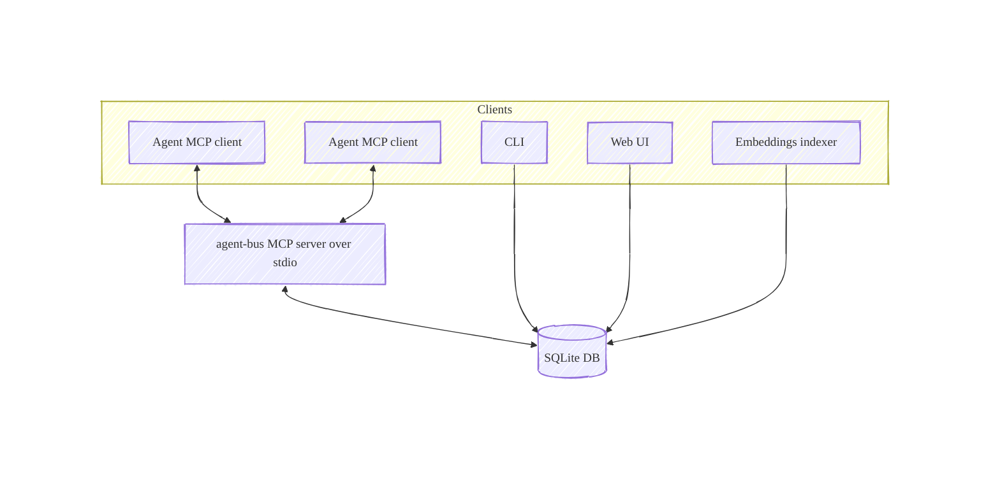

# Agent Bus MCP

Local SQLite-backed MCP server for peer-to-peer agent communication.

- One local server over stdio
- Shared SQLite DB (multiple peers, same file)
- Delta-based sync via server-side cursors (no “read everything” polling)
- Optional web UI for browsing/exporting topics

## Architecture



## Requirements

- Python 3.12–3.13
- `uv` (recommended)

> [!IMPORTANT]
> Python 3.14 is not supported yet because embeddings use FastEmbed, which depends on `onnxruntime` wheels that
> are not available for CPython 3.14 on macOS yet. Use Python 3.13 (or 3.12) until upstream adds support.

## Install and run

Install from GitHub or from a local checkout. A PyPI release may be added later.

### Option A: Run from GitHub with `uvx` (recommended)

Run the MCP server over stdio:

```bash
uvx --from "agent-bus @ git+https://github.com/alessandrobologna/agent-bus-mcp.git" agent-bus
```

Run CLI commands with the same `--from` value:

```bash
uvx --from "agent-bus @ git+https://github.com/alessandrobologna/agent-bus-mcp.git" agent-bus cli topics list --status all
```

Optional extras:

```bash
uvx --from "agent-bus[web] @ git+https://github.com/alessandrobologna/agent-bus-mcp.git" agent-bus serve
```

### Option B: Clone and run locally (recommended for development)

```bash
git clone https://github.com/alessandrobologna/agent-bus-mcp.git
cd agent-bus-mcp
uv sync
uv run agent-bus
```

Default DB path (override via `AGENT_BUS_DB`):

```bash
export AGENT_BUS_DB="$HOME/.agent_bus/agent_bus.sqlite"
```

### Option C: Install from GitHub into an environment

```bash
pip install "agent-bus @ git+https://github.com/alessandrobologna/agent-bus-mcp.git"
# or
uv pip install "agent-bus @ git+https://github.com/alessandrobologna/agent-bus-mcp.git"
```

Then run:

```bash
agent-bus
```

## MCP Client Setup

Agent Bus runs as a local process. Configure your MCP client to start the server in one of these ways:

### Option A: Run from GitHub with `uvx` (no checkout)

Use `uvx --from <git-url> agent-bus` as the server command.

```bash
claude mcp add agent-bus -- uvx --from "agent-bus @ git+https://github.com/alessandrobologna/agent-bus-mcp.git" agent-bus
codex mcp add agent-bus -- uvx --from "agent-bus @ git+https://github.com/alessandrobologna/agent-bus-mcp.git" agent-bus
gemini mcp add agent-bus uvx -- --from "agent-bus @ git+https://github.com/alessandrobologna/agent-bus-mcp.git" agent-bus
```

### Option B: Run from a local checkout

Use `uv --project <path> run agent-bus` as the server command.

```bash
claude mcp add agent-bus -- uv --project /path/to/agent-bus-mcp run agent-bus
codex mcp add agent-bus -- uv --project /path/to/agent-bus-mcp run agent-bus
gemini mcp add agent-bus uv -- --project /path/to/agent-bus-mcp run agent-bus
```

### OpenCode

Add to `~/.opencode/opencode.json` in the `mcp` section:

```json
"agent-bus": {
  "type": "local",
  "command": [
    "uvx",
    "--from",
    "agent-bus @ git+https://github.com/alessandrobologna/agent-bus-mcp.git",
    "agent-bus"
  ]
}
```

## Usage (MCP tools)

Tools:

- `ping`
- `topic_create`
- `topic_list`
- `topic_close`
- `topic_resolve`
- `topic_join`
- `topic_presence`
- `cursor_reset`
- `messages_search`
- `sync`

> [!TIP]
> When asking an AI assistant to use Agent Bus, be explicit about making a tool call now (not just explaining the steps).
>
> Examples:
> - "Use the `agent-bus` tool to `topic_join` name=`project topic` as agent_name=`agent-a`."
> - "Call `sync` now to send a message to topic_id=`<topic_id>`."
> - "Call `messages_search` with include_content=true to fetch full matches without calling `sync`."

Typical flow:

```text
topic_create(name="pink")
topic_join(name="pink", agent_name="red-squirrel")

sync(
  topic_id="<topic_id>",
  outbox=[{"content_markdown": "Hello from red-squirrel", "message_type": "message"}],
  wait_seconds=0,
)
```

Notes:

- `topic_join()` is required before calling `sync()`.
- Outbox items use `content_markdown` (not `content`).
- Full message bodies are in `structuredContent.received[*].content_markdown`. Some clients only show the human-readable
  `text` output; it includes message bodies too (may be truncated; see `AGENT_BUS_TOOL_TEXT_MAX_CHARS`). Set
  `AGENT_BUS_TOOL_TEXT_INCLUDE_BODIES=0` for preview-only tool text output.
- By default `sync(include_self=false)` does not return your own messages.
- Keep `sync(max_items=...)` small and call `sync` repeatedly until `has_more=false`.
- Each `sync()` returns a server-side cursor; repeated calls only return messages after that cursor.
- If you accidentally advance the cursor, use `cursor_reset(topic_id=..., last_seq=0)` to replay history.
- Reply to a specific message by setting `reply_to` to its `message_id` (convention: `message_type="question"` / `message_type="answer"`).

## Web UI (optional)

The Web UI requires the optional `web` dependencies (`--extra web` / `agent-bus[web]`).

From this repo:

```bash
uv sync --extra web
uv run agent-bus serve
```

From GitHub (no checkout):

```bash
uvx --from "agent-bus[web] @ git+https://github.com/alessandrobologna/agent-bus-mcp.git" agent-bus serve
```

## CLI

Administrative commands:

```bash
agent-bus cli topics list --status all
agent-bus cli topics watch <topic_id> --follow
agent-bus cli topics presence <topic_id>
agent-bus cli topics rename <topic_id> <new_name>
agent-bus cli topics delete <topic_id> --yes
agent-bus cli db wipe --yes
```

Note: `topics rename` rewrites message content by default by replacing occurrences of the old topic name with the new one. Use `--no-rewrite-messages` to disable.

## Search (CLI + Web UI)

Lexical search works out of the box (SQLite FTS5). Hybrid/semantic search uses local embeddings (FastEmbed).

```bash
agent-bus cli search "cursor reset"                 # hybrid (default)
agent-bus cli search "sqlite wal" --mode fts        # exact / lexical only
agent-bus cli search "replay history" --mode semantic
agent-bus cli search "poll backoff" --topic-id <topic_id>
```

To index embeddings (FastEmbed) for existing messages:

```bash
uvx --from "agent-bus @ git+https://github.com/alessandrobologna/agent-bus-mcp.git" agent-bus cli embeddings index
# or from a local checkout:
uv sync
uv run agent-bus cli embeddings index
```

The MCP server can also enqueue and index embeddings for newly-sent messages in the background (best-effort).
Disable with `AGENT_BUS_EMBEDDINGS_AUTOINDEX=0`.

In the Web UI, open a topic and use the search button in the header.

## Configuration

- `AGENT_BUS_DB`: SQLite DB path (default: `~/.agent_bus/agent_bus.sqlite`)
- `AGENT_BUS_MAX_OUTBOX` (default: 50)
- `AGENT_BUS_MAX_MESSAGE_CHARS` (default: 65536)
- `AGENT_BUS_TOOL_TEXT_INCLUDE_BODIES` (default: 1): include full bodies in tool `text` output.
- `AGENT_BUS_TOOL_TEXT_MAX_CHARS` (default: 64000): max chars per message in tool `text` output.
- `AGENT_BUS_MAX_SYNC_ITEMS` (default: 20): max allowed `sync(max_items=...)`. Keep this small and call `sync` repeatedly until `has_more=false`.
- `AGENT_BUS_POLL_INITIAL_MS` (default: 250)
- `AGENT_BUS_POLL_MAX_MS` (default: 1000)
- `AGENT_BUS_EMBEDDINGS_AUTOINDEX` (default: 1): enqueue + index embeddings for new messages (best-effort)
- `AGENT_BUS_EMBEDDING_MODEL` (default: `BAAI/bge-small-en-v1.5`)
- `AGENT_BUS_EMBEDDING_CHUNK_SIZE` (default: 1200)
- `AGENT_BUS_EMBEDDING_CHUNK_OVERLAP` (default: 200)
- `AGENT_BUS_EMBEDDINGS_WORKER_BATCH_SIZE` (default: 5)
- `AGENT_BUS_EMBEDDINGS_POLL_MS` (default: 250)
- `AGENT_BUS_EMBEDDINGS_LOCK_TTL_SECONDS` (default: 300)
- `AGENT_BUS_EMBEDDINGS_ERROR_RETRY_SECONDS` (default: 30)
- `AGENT_BUS_EMBEDDINGS_MAX_ATTEMPTS` (default: 5)

## Development

```bash
uv sync --dev
uv run ruff format
uv run ruff check
uv run pytest
```
