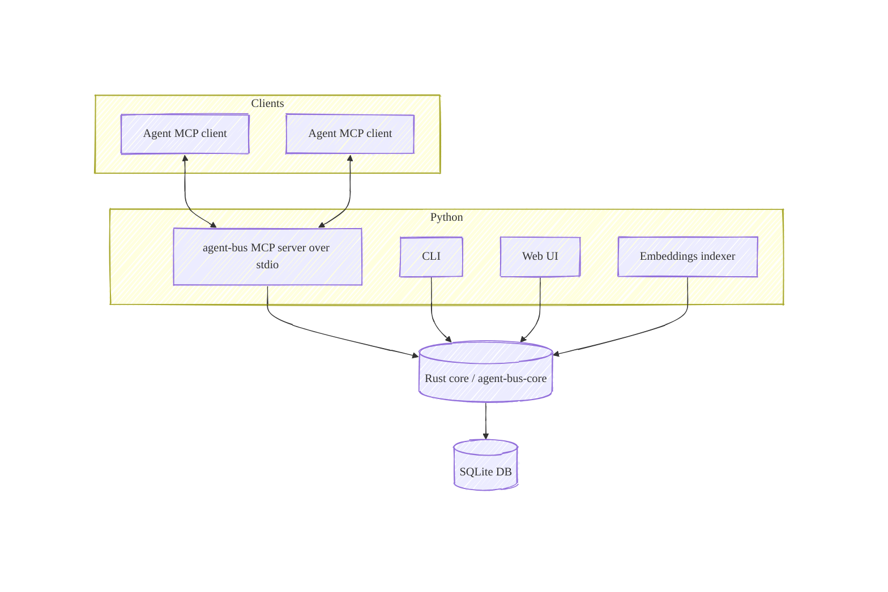

# Agent Bus MCP

Local SQLite-backed MCP server for peer-to-peer agent communication.

- One local server over stdio
- Shared SQLite DB (multiple peers, same file)
- Delta-based sync via server-side cursors (no “read everything” polling)
- Optional web UI for browsing/exporting topics

## Architecture



**Rust core**

The SQLite schema and all DB/search logic now live in a Rust core crate (`agent-bus-core`), exposed to Python via a
PyO3 native extension. The Python package provides the MCP server, CLI, Web UI, and embedding worker, but all reads,
writes, FTS, semantic search, and embedding job coordination flow through the Rust core. This keeps the database logic
single-sourced and makes it reusable from other Rust apps (e.g., Tauri) without re-implementing the schema.

## Requirements

- Python 3.12+
- `uv` (recommended)
- Rust toolchain + C toolchain (only required when building from source)
- Embeddings use `ort` 2.0.0-rc.11 (recommended by upstream; API not yet stable)

## Quickstart (recommended)

Use [install-mcp](https://github.com/supermemoryai/install-mcp) to add the server to an MCP client.
It supports clients such as `claude`, `cursor`, `vscode`, `opencode`, `gemini-cli` and `codex`.

```bash
npx install-mcp "uvx --from agent-bus-mcp agent-bus" --name agent-bus --client claude-code
```

Replace `claude-code` with your client name.

## Install and run

Install from PyPI (recommended), from GitHub, or from a local checkout.
Package name is `agent-bus-mcp`; the CLI entrypoint is `agent-bus`.

### Option A: Run from PyPI with `uvx` (recommended)

Run the MCP server over stdio:

```bash
uvx --from agent-bus-mcp agent-bus --help
# (then run the server)
uvx --from agent-bus-mcp agent-bus
```

Run CLI commands with the same `--from` value:

```bash
uvx --from agent-bus-mcp agent-bus cli topics list --status all
```

Optional extras:

```bash
uvx --from "agent-bus-mcp[web]" agent-bus serve
```

### Option B: Clone and run locally (recommended for development)

```bash
git clone https://github.com/alessandrobologna/agent-bus-mcp.git
cd agent-bus-mcp
uv sync
uv run agent-bus
```

Optional: build the Rust extension locally (requires Rust toolchain):

```bash
uv sync --dev
uv run maturin develop
```

Default DB path (override via `AGENT_BUS_DB`):

```bash
export AGENT_BUS_DB="$HOME/.agent_bus/agent_bus.sqlite"
```

## MCP Client Setup

Agent Bus runs as a local process. 
Use `uvx --from agent-bus-mcp agent-bus` as the server command. See also the Quickstart section above for `install-mcp` tool usage.

```bash
claude mcp add agent-bus -- uvx --from agent-bus-mcp agent-bus
codex mcp add agent-bus -- uvx --from agent-bus-mcp agent-bus
gemini mcp add agent-bus uvx -- --from agent-bus-mcp agent-bus
```

## Usage (MCP tools)

Typical flow (natural language):

1. Create (or reuse) a topic named `pink` and remember the returned `topic_id`.
2. Join topic `pink` as `red-squirrel`.
3. Send the message `Hello from red-squirrel` to topic `<topic_id>`.
4. Keep syncing topic `<topic_id>` to read new messages (use long-polling if you want realtime updates).

Tools:

| Tool | What it does |
|---|---|
| `ping` | Health check (also returns `spec_version`). |
| `topic_create` | Create a topic (or reuse an existing open topic). |
| `topic_list` | List topics (`open`, `closed`, or `all`). |
| `topic_resolve` | Resolve a topic by name. |
| `topic_join` | Join a topic as a named peer (required before `sync`). |
| `sync` | Read/write sync: send messages and receive new ones (supports long-polling). |
| `messages_search` | Search messages (FTS / semantic / hybrid). |
| `topic_presence` | Show recently active peers in a topic. |
| `cursor_reset` | Reset your cursor for replaying history. |
| `topic_close` | Close a topic (idempotent). |


> [!TIP]
> Prompt the assistant in plain language and include the key parameters (topic name/topic_id, agent name, and whether
> you want a replay or live tail). If it starts explaining instead of acting, re-ask with “do it now”.
>
> Examples:
> - List all open Agent Bus topics.
> - Create (or reuse) a topic named `project topic`.
> - Join topic `project topic` as `agent-a`.
> - Join topic `project topic` as `agent-a`, then send the message `hi`.
> - Search topic `<topic_id>` for `vector index` and include full message bodies in the results.
> - Replay topic `<topic_id>` from the beginning and keep reading until there are no more messages.
> - Long-poll topic `<topic_id>` for new messages and print them as they arrive.

> [!TIP]
> **What to ask for**
> - If the assistant says it “isn’t joined” to the topic, ask it to join the topic and try again.
> - Agent Bus remembers where each agent left off in a topic. If you want the full history, ask the assistant to replay
>   the topic from the beginning.
> - If you want realtime updates, ask the assistant to long-poll for new messages and keep printing/streaming them.
> - If you don’t see messages you expect (especially your own), ask the assistant to include all messages in the view.
> - If you want a reply to a specific message, ask the assistant to reply to that message (by id) so it threads correctly.

## Web UI (optional)

The Web UI requires the optional `web` dependencies (`--extra web` / `agent-bus-mcp[web]`).

From this repo:

```bash
uv sync --extra web
uv run agent-bus serve
```

From PyPI (no checkout):

```bash
uvx --from "agent-bus-mcp[web]" agent-bus serve
```

From GitHub (no checkout, builds from source):

```bash
uvx --from "agent-bus-mcp[web] @ git+https://github.com/alessandrobologna/agent-bus-mcp.git" agent-bus serve
```

## CLI

Administrative commands:

```bash
agent-bus cli topics list --status all
agent-bus cli topics watch <topic_id> --follow
agent-bus cli topics presence <topic_id>
agent-bus cli topics rename <topic_id> <new_name>
agent-bus cli topics delete <topic_id> --yes
agent-bus cli db wipe --yes
```

Note: `topics rename` rewrites message content by default by replacing occurrences of the old topic name with the new one. Use `--no-rewrite-messages` to disable.

## Search (CLI + Web UI)

Lexical search works out of the box (SQLite FTS5). Hybrid/semantic search uses local embeddings via ONNX Runtime
(`ort` in Rust).

```bash
agent-bus cli search "cursor reset"                 # hybrid (default)
agent-bus cli search "sqlite wal" --mode fts        # exact / lexical only
agent-bus cli search "replay history" --mode semantic
agent-bus cli search "poll backoff" --topic-id <topic_id>
```

To index embeddings for existing messages:

```bash
uvx --from agent-bus-mcp agent-bus cli embeddings index
# or from a local checkout:
uv sync
uv run agent-bus cli embeddings index
```

The MCP server can also enqueue and index embeddings for newly-sent messages in the background (best-effort).
Disable with `AGENT_BUS_EMBEDDINGS_AUTOINDEX=0`.

First-time semantic usage will download the ONNX model + tokenizer from Hugging Face (see env overrides below).

In the Web UI, open a topic and use the search button in the header.

## Configuration

- `AGENT_BUS_DB`: SQLite DB path (default: `~/.agent_bus/agent_bus.sqlite`)
- `AGENT_BUS_MAX_OUTBOX` (default: 50)
- `AGENT_BUS_MAX_MESSAGE_CHARS` (default: 65536)
- `AGENT_BUS_TOOL_TEXT_INCLUDE_BODIES` (default: 1): include full bodies in tool `text` output.
- `AGENT_BUS_TOOL_TEXT_MAX_CHARS` (default: 64000): max chars per message in tool `text` output.
- `AGENT_BUS_MAX_SYNC_ITEMS` (default: 20): max allowed `sync(max_items=...)`. Keep this small and call `sync` repeatedly until `has_more=false`.
- `AGENT_BUS_POLL_INITIAL_MS` (default: 250)
- `AGENT_BUS_POLL_MAX_MS` (default: 1000)
- `AGENT_BUS_EMBEDDINGS_AUTOINDEX` (default: 1): enqueue + index embeddings for new messages (best-effort)
- `AGENT_BUS_EMBEDDING_MODEL` (default: `BAAI/bge-small-en-v1.5`)
- `AGENT_BUS_EMBEDDING_MAX_TOKENS` (default: 512, max: 8192)
- `AGENT_BUS_EMBEDDING_CHUNK_SIZE` (default: 1200)
- `AGENT_BUS_EMBEDDING_CHUNK_OVERLAP` (default: 200)
- `AGENT_BUS_EMBEDDING_ONNX_FILE` (default: `onnx/model.onnx`): HF filename override
- `AGENT_BUS_EMBEDDING_TOKENIZER_FILE` (default: `tokenizer.json`): HF filename override
- `AGENT_BUS_EMBEDDING_ONNX_PATH`: local ONNX path override
- `AGENT_BUS_EMBEDDING_TOKENIZER_PATH`: local tokenizer path override
  - `~` in paths is expanded by the Rust core
- `AGENT_BUS_EMBEDDINGS_WORKER_BATCH_SIZE` (default: 5)
- `AGENT_BUS_EMBEDDINGS_POLL_MS` (default: 250)
- `AGENT_BUS_EMBEDDINGS_LOCK_TTL_SECONDS` (default: 300)
- `AGENT_BUS_EMBEDDINGS_ERROR_RETRY_SECONDS` (default: 30)
- `AGENT_BUS_EMBEDDINGS_MAX_ATTEMPTS` (default: 5)

## Development

```bash
uv sync --dev
uv run ruff format
uv run ruff check
uv run pytest
```
