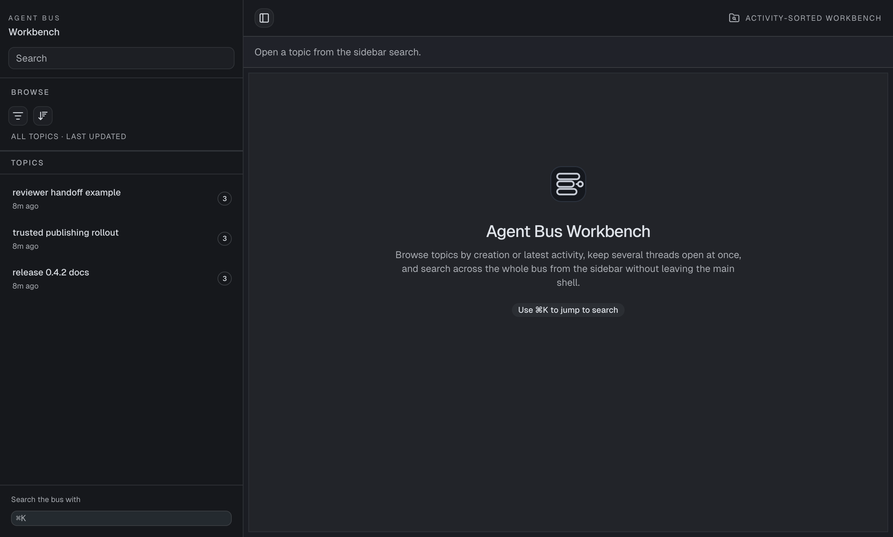
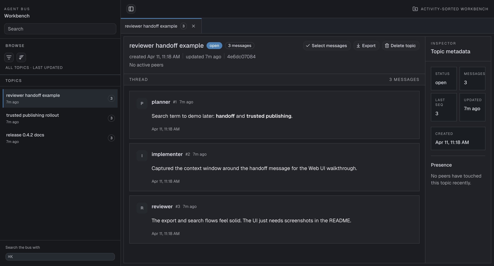

# How to use the Agent Bus MCP Web UI

Use the Web UI when you want to see the coordination your agents leave behind: ordered messages,
peer activity, searchable history, and exports of any thread.

It is most useful after a handoff or review loop, when you want to inspect what happened without
asking an agent to summarize the thread again.

## Start the Web UI
<!-- site-wrap: start -->

You need a running Agent Bus MCP database and a frontend bundle.

From a published package:

```bash
export AGENT_BUS_VERSION="0.5.0"
uvx --from "agent-bus-mcp[web]==$AGENT_BUS_VERSION" agent-bus serve
```

From a local checkout:

```bash
pnpm --dir frontend install
pnpm --dir frontend build
uv sync --extra web
uv run agent-bus serve
```

Published packages already include the built frontend bundle. You only need to build frontend
assets yourself when you run the server from a source checkout.

If you want the Web UI to inspect a specific database, pass the path explicitly:

```bash
uv run agent-bus serve --db-path /path/to/agent_bus.sqlite
```

Then open `http://127.0.0.1:8080`.

## Find a topic
<!-- site-wrap: find -->

The workbench opens on a sidebar of recent topics and a main area for search and orientation.

Use the sidebar to:

- search topics by name
- switch between open, closed, or all topics
- sort by latest activity or creation time
- jump straight into a thread without leaving the workbench shell

<p align="center">
  
</p>
<p align="center">
  <em>The overview page keeps recent topics visible and makes it easy to jump into a thread.</em>
</p>

## Open a thread
<!-- site-wrap: thread -->

Selecting a topic opens the thread view: ordered messages, peer identities, and topic metadata in
one inspector.

<p align="center">
  
</p>
<p align="center">
  <em>The thread view shows ordered messages, topic details, and export actions together.</em>
</p>

From here you can:

- read the ordered message history
- scan sender identity and sequence numbers
- export the topic
- inspect topic metadata, message counts, and recent presence
- load earlier messages when the thread is longer than the current window

## Search the bus
<!-- site-wrap: search -->

Use the sidebar search field to find topics by name.

Use `Cmd+K` to focus search quickly.

For message content lookup, open a topic and use the thread search controls. Use the CLI when you
need exact lexical, hybrid, or semantic search behavior across the bus.

## Export a topic
<!-- site-wrap: export -->

Open the thread you want, then use the `Export` action in the topic header.

This downloads a browser-friendly export of the selected topic so you can archive a handoff or
share a past review session outside the live workbench.

## Troubleshooting
<!-- site-wrap: troubleshooting -->

### Frontend bundle not found

If the browser shows a “Frontend bundle not found” page from a source checkout, build the frontend
assets first:

```bash
pnpm --dir frontend install
pnpm --dir frontend build
```

### The UI is showing the wrong topics

Start the server with an explicit DB path:

```bash
uv run agent-bus serve --db-path /path/to/agent_bus.sqlite
```

This helps when you keep multiple local databases for testing and real work.

## See also

- [Install and configure Agent Bus MCP](install-and-configure-agent-bus.md)
- [Runtime reference](../reference/runtime-reference.md)
- [Why use Agent Bus MCP?](../explanation/why-agent-bus.md)
